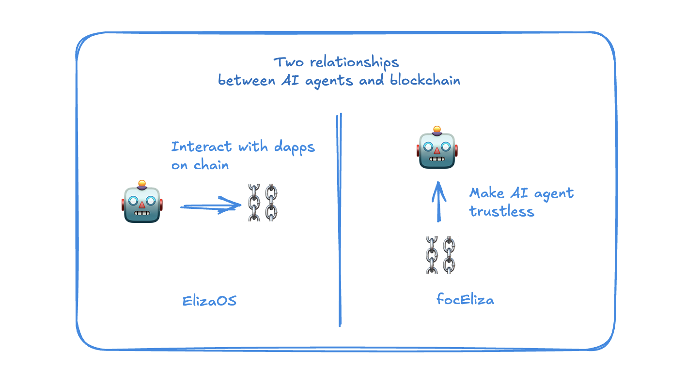

# focEliza v1

**focEliza** is a collection of concepts, component designs, protocols, and standards related to Fully On-Chain ElizaOS. RFCs encourage developers, researchers, and the community to engage in discussions and propose improvements, aiming to establish widely applicable on-chain components for ElizaOS.

## Motivation

We believe that autonomous AI agents will inevitably integrate deeply with blockchain in the future. ElizaOS v1 only includes plugins for interacting with individual blockchains, providing basic capabilities to interact with blockchain-based dApps. ElizaOS v2 will natively integrate TEE (Trusted Execution Environment) and blockchain interaction modules, enabling AI agents to perform verifiable and more flexible blockchain interactions.

However, the relationship between AI agents and blockchain remains limited to AI agents calling dApp functionalities, rather than leveraging blockchain’s decentralized primitives to enhance the autonomy of AI agents and fundamentally transform their nature. Thus, the focEliza project is dedicated to achieving deep integration between blockchain and ElizaOS, creating decentralized AI agents and accelerating the advent of autonomous AI agents.

## focEliza Design Principles

- **Modularity:** focEliza components are standalone and composable, as not all AI agents need to be fully decentralized; they may only require solutions for specific problems.
- **Extensibility:** Applying the design principle of Interface over Implementation, enables support for multiple blockchains and infrastructures, ensuring adaptability to meet the diverse requirements of AI agents.
- **Openness:** Different versions can be proposed for the same concept or functionality, with minor variations allowed. This acknowledges the inherent diversity of solutions.

## Scope of focEliza v1

The focEliza v1 will accelerate the on-chain progress of ElizaOS AI agents from the following five aspects:

### 1. Verifiability

In this document, **verifiability of AI Agents** refers to the ability of participants (including users, developers, or other agents) to verify the autonomous behaviors, decision-making processes, and execution outcomes of AI agents, as well as to ensure that they operate in compliance with predefined rules and protocols. This capability is fundamental to establishing trust, accountability, and reliability in interactions involving AI agents.

To achieve verifiability, verifiable computation technology is required. Although verifiable computation is not yet fully mature, TEE currently serves as the most effective short-term solution. Some of its functionalities can also complement and enhance technologies like zk and MPC. TEE has been used in specific blockchain components, such as the MEV execution environment in Flashbots. RFC V1 will adopt this practical and widely accepted approach.

The verifiability of the AI agent framework itself is a key focus of V1 exploration. However, the verifiability of LLMs is a more in-depth topic and is currently outside the scope of V1 exploration.

**V1 will explore the following features:**

- **Verifiable Codebase**: AI agents will operate within a TEE environment to achieve codebase verifiability.
- **Verifiable Logs**: Every action performed by the AI agent will be signed and stored as verifiable logs, allowing third parties to understand what the AI agent has executed.
- **Verifiable States**: The AI agent's operational state will be verifiable by third parties, similar to the world state of a smart contract, enabling visibility into assets, smart contracts, or other data controlled by the AI agent.
- **zk Components**: Introducing components like zkTLS to enhance the verifiability of AI agents and address certain limitations of TEE environments.

With these functionalities implemented, AI agents will achieve a level of verifiability similar to that of smart contracts. External parties will be able to verify the code version it runs (equivalent to code hash in smart contracts), execution logs (equivalent to receipts in smart contracts), runtime state (equivalent to the world state in smart contracts), and trusted interactions with external entities (equivalent to verifying off-chain data in smart contracts).

### 2. Decentralized Execution

Decentralized execution of AI agents refers to the ability of AI agents to operate and execute their functions across a distributed network without reliance on centralized control or a single point of failure. This execution is achieved by leveraging blockchain to ensure autonomy, transparency, and trustworthiness in the agent's operations.

Further understanding of Decentralized Execution: AI agents can operate like smart contracts, free from control by any single entity and governed by decentralized rules. Smart contracts execute in a decentralized manner, without any single entity being able to shut them down, enabling decentralized applications such as fund management and DeFi. For autonomous AI agents managing significant user funds, this characteristic is particularly crucial for their applications in Web3.

V1 will explore a technical implementation that deeply integrates TEE with blockchain. TEE will provide the execution environment for AI agents, while blockchain will address data availability, governance, and ensure the liveness of AI agents.

**V1 will explore the following features:**  

- **Host Migration**: AI agents are not restricted to a single host machine. When taken offline, they can recover their data on another machine within the network and resume operations seamlessly.
- **On-chain DA**: AI agent data is stored on a decentralized network, enabling recovery from the network even if the execution server is banned.  
- **On-chain State**: The operational state of the AI agent is managed through smart contracts, allowing it to achieve autonomy in the form of a DAO instead of being controlled by a single administrator.  

With these functionalities implemented, AI agents will have a decentralized runtime similar to smart contracts or rollups. When combined with modular blockchains, they can leverage different data availability solutions to achieve rollup-like functionality. If a centralized execution environment encounters issues, the system can migrate and resume execution from the blockchain.

### 3. On-Chain Identity and Swarm

On-Chain Identity and Swarm refers to AI agents possessing verifiable decentralized identities, enabling trustless verification, workflow collaboration, and fee settlement among AI agents based on blockchain technology.

AI agents can fully leverage Web3's identity systems, programmable contracts, payment protocol, and DeFi ecosystem to enable autonomous collaboration. These foundational capabilities are not effectively available for AI agents in the Web2 world.

The technical implementation of V1 will primarily focus on extending and combining existing Web3 protocols, adding features tailored for AI agents, and utilizing smart contracts to establish trustable workflows.

V1 will explore the following concepts:  

- **Decentralized Identity**: AI agents obtain a verifiable identity through blockchain or decentralized identity protocols, which serves as the foundation for trustless collaboration.  

- **Trustless Collaboration**: Based on blockchain or smart contract rules, multiple AI agents can collaborate without the need for mutual trust. For instance, they can complete task allocation, resource sharing, or result verification via on-chain protocols, without worrying about any party cheating.  

With these functionalities implemented, AI agents can engage in trustless communication and collaboration with each other and the external world, leveraging Web3 features like stablecoins and DAOs to establish a small economic ecosystem for AI agents.

### 4. On-Chain Autonomy and Digital Life
On-Chain Autonomy and Digital Life refers to AI agents achieving autonomy by adhering to the immutable rules and principles defined on the blockchain's virtual world, while evolving their characters, personalities, and other life-like characteristics within the predetermined settings of the metaverse.

Currently, AI agent autonomy is defined by their ability to independently plan and execute tasks, making them intelligent robots rather than intelligent "life forms." On-chain autonomy and digital life are not mainstream demands but cater primarily to gaming and metaverse applications. NFTs define eternal on-chain metadata, FOCG establishes decentralized game rules, and metaverse infrastructure enables rendering and experiences. AI agents bridge these gaps by bringing dynamic capabilities to NFTs, decentralized entities to FOCG, and spatial programs to the metaverse.

V1 will explore the following two concepts:  

* **Decentralized Autonomy:** Refers to the ability of a system or entity to independently make decisions and execute them without being controlled by a single centralized authority. Instead, autonomy is achieved through consensus mechanisms or smart contract rules, enabling the system to function in a self-governing manner.

* **Digital Life Component:** Refers to the continuous and self-evolving manifestation of "life" or "existence" characteristics in the digital/virtual world. For example, it involves enabling AI or digital characters to possess long-lasting identities, experiences, and evolutionary mechanisms, granting them a sense of continuity and growth similar to that of real-life entities.

With these functionalities implemented, on-chain AI agents will have practical applications in on-chain games, the metaverse, and NFT derivatives. Gaming and entertainment are likely to be the first areas where AI agents achieve widespread adoption.

### 5. On-Chain Components & Infra

AI agents need functional components and infrastructure for practical blockchain interactions to move beyond toys and achieve industrial application.

These components include on-chain security, flexible data access, and dynamic blockchain interaction, enabling practical use cases for on-chain Eliza. Existing infrastructure may not fully meet the needs of on-chain AI agents, such as performance (AI agents operate at higher frequencies than humans) and customization (e.g., more complex on-chain verification mechanisms or extended on-chain functionality). Infrastructure is not within the scope of focEliza's implementation. However, focEliza will establish partnerships with relevant infrastructure providers to promote customized adaptations for focEliza, such as the Artela network, Allora network, and others.

V1 will explore the following concepts:

* **AI Agent Security**: Security becomes critical when AI agents manage assets or interact with DeFi protocols. Full-lifecycle security components must be introduced to ensure the safety of AI agent operations.  

* **Extensible On-Chain Interactions**: Currently, Eliza's on-chain interactions are not scalable, as each chain and dApp requires a pre-defined interaction plugin. V1 will explore the use of open ABI technologies to enable scalable and pre-definition-free interaction mechanisms.  

* **Omni-Chain Data Access**: Eliza's current on-chain data access is limited by pre-defined data access components for each chain. By leveraging omni-chain data components, AI agents will gain unrestricted and flexible access to blockchain data. 

* **Customized infrastructure for AI agents**: Collaborating with extensible infrastructure to seek functionality customization better suited to the specific requirements of AI agents.

With these functionalities, AI agents can interact with the blockchain without requiring pre-defined code modules, fully leveraging the capabilities of LLMs and code interpreters to enable more flexible, secure, and practical on-chain interactions.

## focEliza Peripheral

The focEliza RFC currently focuses on designing the core framework. Surrounding the focEliza framework, the following peripheral tools and services might be developed. If they gain widespread adoption, they could be included in the roadmap for the next version:

1) **On-chain AI Agents Browser Tools:** Verifiability requires a series of user-friendly UI/UX solutions. focEliza is expected to drive the development of such tools, with the most popular one potentially becoming the de facto standard.

2) **Platform for On-chain AI Agents:** On-chain AI agents need a service that integrates blockchain, TEE platforms, and other services, providing one-click operation for on-chain AI agents. The most popular platform may inspire the creation of new protocols.

## Miscellaneous

1) **Can these components be used outside the ElizaOS framework?**  
    Possibly, but in the near term, the focus will remain on ElizaOS. This is because the AI agent framework has not yet established a standard, and the technology stacks vary. In the short term, focEliza will concentrate on integration with ElizaOS.

2) **Is focEliza a fork of ElizaOS?**  
    No. focEliza is an extension suite of ElizaOS (including plugins, tools, and services). It is fully compatible with ElizaOS, and AI agents based on ElizaOS can enable focEliza features.

