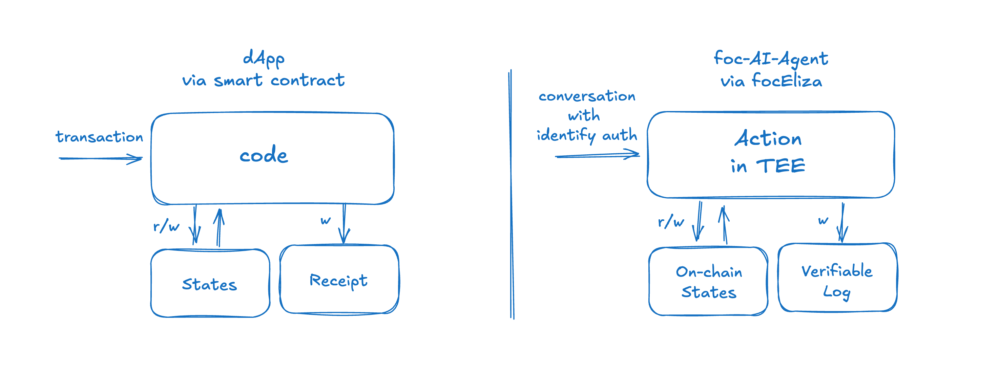

# Smart Action: Let AI Agent Work in a Decentralized Manner Like a Smart Contract

## Smart Action: LLMs-based Smart Contract!

If we had to introduce Smart Action in one sentence, we’d say: an “LLM-based smart contract”!

In the past, dapps on the blockchain could only be implemented via smart contracts, which required writing concise code—so their functionalities were relatively simple.

However, Smart Action operates in a trustless manner just like smart contracts by executing on on-chain states. The difference is that, in addition to writing code, it can also incorporate AI capabilities via prompts, enabling truly “intelligent” contracts!

While smart contracts are deployed on the blockchain, Smart Action is deployed within the AI Agent! The AI Agent integrates LLM, TEE, and smart contracts, forming a powerful whole!

## 1. ElizaOS: A Web3-friendly AI Agent Framework

Eliza is a powerful multi-agent simulation framework designed to create, deploy, and manage autonomous AI agents. Built with TypeScript, it provides a flexible and extensible platform for developing intelligent agents that can interact across multiple platforms while maintaining consistent personalities and knowledge.

The key feature of ElizaOS is its plugin and Action systems, which allow developers to add custom functionalities to the AI Agent via plugins. Currently, ElizaOS already includes many plugins that interact with blockchain and DeFi protocols.

## 2. focEliza: Fully on-chain ElizaOS Running on TEE and Blockchain

focEliza is a compatible upgraded framework for ElizaOS. It brings the following enhancements:

- The ElizaOS framework and LLM run inside a TEE, ensuring verifiable computation.
- ElizaOS’s data and state management are hosted on the blockchain, ensuring state verifiability.

ElizaOS currently runs on centralized servers and, like many centralized bots, faces challenges of over-centralization when it comes to fund custody and fairness. focEliza completely decentralizes ElizaOS, enabling it to operate like a blockchain. This transformation allows the AI Agent to become an independent, decentralized entity capable of processing tasks in a trustless manner.

## 3. Action: Add Custom Functionality to the AI Agent

Action is the extensible, custom functionality component within the ElizaOS (AI Agent framework) that equips the AI Agent with specific features for end-users.

As an extension of ElizaOS, Action enables developers to add custom functions so that the AI Agent can handle specific scenario-based tasks for users.

However, the current ElizaOS is centralized and typically suffers from several issues:

1. **Non-verifiability:** It is not possible to verify whether the AI Agent is executing according to the predetermined rules.
2. **Centralized State:** The state managed by the AI Agent is stored in a centralized database, making it susceptible to tampering.
3. **Fund Custody:** The private keys held by the AI Agent are managed centrally, posing risks as administrators have access.

In scenarios such as DeFAI, AI DAO, and on-chain gaming, these centralization issues become critical. Therefore, the Action component in focEliza will be further upgraded—it will work just like a smart contract!

## 4. Smart Contract: State Transition Function

A smart contract is a decentralized state transition function. When a transaction calls a smart contract, it triggers the execution of its state transition function:

1. Its inputs are the calldata parameters carried by the transaction along with the world state.
2. Upon execution, the state transition function produces a new world state and a receipt.
3. The smart contract then preserves the new world state.

## 5. Smart Prompt: State Transition Prompt

At the core of Smart Action is the design of a **state transition prompt**.

This prompt is executed by an LLM and possesses special capabilities:

1. It accepts state data in JSON format.
2. It constrains the LLM to process based on the input state data.
3. It enforces the production of a new state.
4. It requires the LLM to perform state transitions according to the functionality described by the developer.

It shares the same attributes as a smart contract’s state transition function:

- **Verifiability:** It is executed within a TEE, and its execution process and results can be verified.
- **On-chain State:** Its state is stored on the blockchain, not managed by a centralized database.

Previously, developers had to write code based on the state transition function to build decentralized applications. Now, with the state transition prompt, developers can build decentralized applications through prompt engineering without writing any code!

## 6. Smart Action: Let AI Agent Provide Decentralized Services for Users

An AI Agent equipped with Smart Action will enable the following use cases:

1. **Achieving Zero-code Smart Contracts:**  
   In the past, implementing a dapp required writing secure and reliable smart contract code. Now, you can achieve the same purpose by defining prompts in natural language!

2. **Realizing Dynamic AI Agent Extension Functionality:**  
   With Smart Action, developers can deploy decentralized functionalities for the AI Agent at any time.

3. **Achieving True DeFAI:**  
   The AI Agent can self-custody funds, dynamically deploy DeFAI interaction protocols, and operate in a trustless manner just like a smart contract—all achievable through Smart Action!

## Resources

[Smart Action Plugin](/collection/plugins/smart-action.md)
