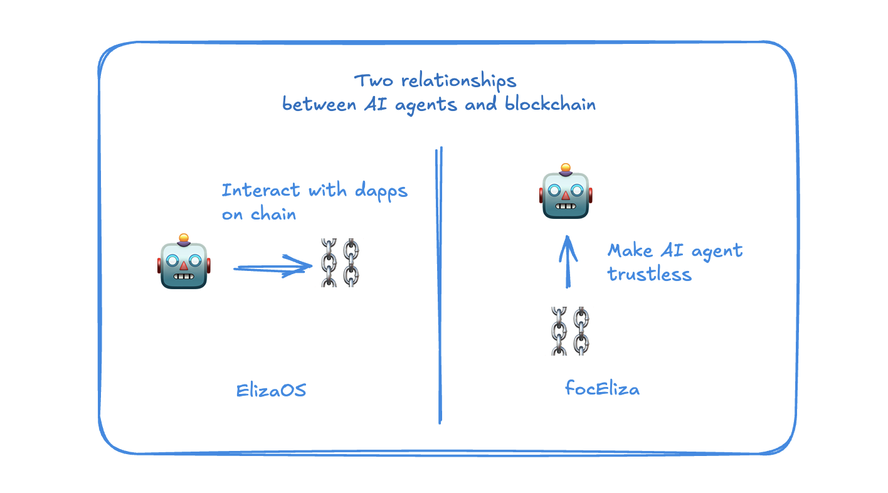
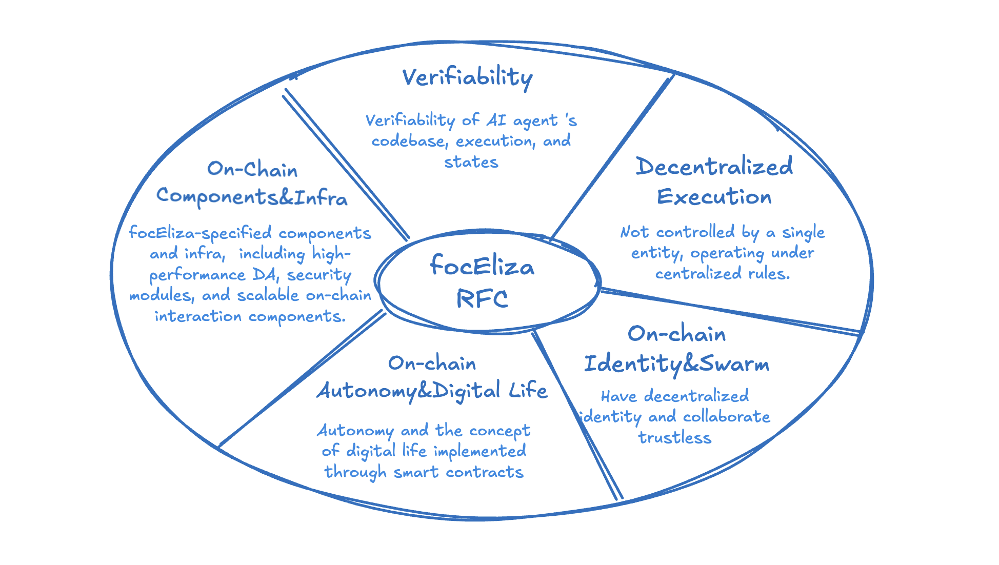

# focEliza v1

**focEliza** 是与 Fully On-Chain ElizaOS 相关的一系列概念、组件设计、协议和标准的集合。RFC 鼓励开发者、研究人员以及社区参与讨论并提出改进建议，旨在为 ElizaOS 建立广泛适用的链上组件。

## 动机

我们相信，未来自主 AI 代理必然会深度整合区块链。ElizaOS v1 仅包含与单个区块链交互的插件，提供与区块链 dApp 交互的基本能力。而 ElizaOS v2 将原生集成 TEE (Trusted Execution Environment) 和区块链交互模块，使 AI 代理能够执行可验证且更灵活的区块链交互。

然而，目前 AI 代理与区块链之间的关系仍然局限于 AI 代理调用 dApp 功能，而非利用区块链的去中心化原语来增强 AI 代理的自治性，从根本上改变其本质。因此，focEliza 项目致力于实现区块链与 ElizaOS 之间的深度整合，打造去中心化 AI 代理，加速自主 AI 代理的到来。

## focEliza 设计原则

- **Modularity:** focEliza 组件是独立且可组合的，因为并非所有 AI 代理都需要完全去中心化；它们可能只需要针对特定问题的解决方案。
- **Extensibility:** 采用 Interface over Implementation 的设计原则，可支持多种区块链和基础设施，确保能够满足 AI 代理多样化的需求。
- **Openness:** 对于相同的概念或功能，可以提出不同版本，并允许细微差别。这体现了对解决方案固有多样性的认可。

## focEliza v1 的范围

focEliza v1 将从以下五个方面加速 ElizaOS AI 代理的链上进展：

### 1. 可验证性

在本文档中，**verifiability of AI Agents** 指的是参与者（包括用户、开发者或其他代理）验证 AI 代理自主行为、决策过程和执行结果的能力，并确保其按照预定义规则和协议运行。这一能力是建立信任、责任和可靠性互动的基础。

为了实现可验证性，需要采用可验证计算技术。尽管可验证计算尚未完全成熟，但目前 TEE 是最有效的短期解决方案，其部分功能也能补充并增强诸如 zk 和 MPC 等技术。TEE 已被用于 Flashbots 中的 MEV 执行环境等特定区块链组件。RFC V1 将采用这一切实可行且广泛接受的方法。

AI 代理框架本身的可验证性是 V1 探索的重点，但 LLMs 的可验证性是更深层次的话题，目前超出 V1 的探索范围。

**V1 将探索以下功能：**

- **Verifiable Codebase**: AI 代理将在 TEE 环境中运行，实现代码库的可验证性。
- **Verifiable Logs**: AI 代理执行的每个操作都将被签名并存储为可验证日志，允许第三方了解 AI 代理执行的内容。
- **Verifiable States**: AI 代理的运行状态将可供第三方验证，类似于智能合约的全局状态，使外界能够查看 AI 代理所控制的资产、智能合约或其他数据。
- **zk Components**: 引入如 zkTLS 等组件，以增强 AI 代理的可验证性，弥补 TEE 环境的某些局限。

通过实现这些功能，AI 代理将获得与智能合约类似的可验证性。外部各方将能够验证其运行的代码版本（相当于智能合约中的代码哈希）、执行日志（相当于智能合约中的回执）、运行状态（相当于智能合约中的全局状态）以及与外部实体的可信交互（相当于验证智能合约中的链下数据）。

### 2. 去中心化执行

AI 代理的去中心化执行指的是 AI 代理能在分布式网络中运行并执行其功能，而无需依赖集中式控制或单点故障。通过利用区块链确保代理操作的自治性、透明性和可信性，从而实现这一目标。

进一步来说，AI 代理可以像智能合约那样运行，不受任何单一实体控制，并遵循去中心化规则。智能合约以去中心化方式执行，没有任何单一实体可以关闭它们，从而实现诸如资金管理和 DeFi 等去中心化应用。对于管理大量用户资金的自主 AI 代理而言，这一特性在 Web3 中尤为关键。

V1 将探索一种将 TEE 与区块链深度整合的技术实现。TEE 将为 AI 代理提供执行环境，而区块链将解决数据可用性、治理问题，并确保 AI 代理持续运行。

**V1 将探索以下功能：**  

- **Host Migration**: AI 代理不受限于单一主机，当脱机时，它们可以在网络内另一台机器上恢复数据并无缝继续运行。
- **On-chain DA**: AI 代理数据存储在去中心化网络中，即使执行服务器被禁用，也能从网络中恢复数据。  
- **On-chain State**: AI 代理的运行状态通过智能合约管理，使其能够以 DAO 形式实现自治，而非由单一管理员控制。

通过这些功能的实现，AI 代理将拥有类似于智能合约或 rollup 的去中心化运行时。结合模块化区块链后，它们可以利用不同的数据可用性解决方案实现类似 rollup 的功能；如果集中式执行环境出现问题，系统可以迁移并从区块链中恢复执行。

### 3. 链上身份与 Swarm

链上身份与 Swarm 指的是 AI 代理拥有可验证的去中心化身份，从而实现基于区块链技术的无信任验证、工作流协作和费用结算。

AI 代理可以充分利用 Web3 的身份系统、可编程合约、支付协议及 DeFi 生态系统，实现自主协作。这些基础能力在 Web2 的 AI 代理中难以获得。

V1 的技术实现将主要聚焦于扩展和整合现有 Web3 协议，增加为 AI 代理量身定制的功能，并利用智能合约建立可信的工作流。

V1 将探索以下概念：  

- **Decentralized Identity**: AI 代理通过区块链或去中心化身份协议获取可验证身份，作为无信任协作的基础。  

- **Trustless Collaboration**: 基于区块链或智能合约规则，多个 AI 代理无需相互信任即可协作。例如，它们可以通过链上协议完成任务分配、资源共享或结果验证，而无需担心任何一方作弊。

通过实现这些功能，AI 代理能够与彼此以及外部世界进行无信任的沟通与协作，并利用 Web3 的稳定币和 DAO 等特性为 AI 代理建立一个小型经济生态系统。

### 4. 链上自治与数字生命

链上自治与数字生命指的是 AI 代理通过遵循区块链虚拟世界中定义的不变规则和原则实现自治，同时在元宇宙的预设环境中演化其角色、个性和其他类生命特征。

目前，AI 代理的自治性主要体现在它们能够独立规划和执行任务，使其更像智能机器人而非智能“生命体”。链上自治与数字生命虽然并非主流需求，但主要面向游戏和元宇宙应用。NFT 定义了永恒的链上元数据，FOCG 建立了去中心化的游戏规则，而元宇宙基础设施则支持渲染和体验。AI 代理通过为 NFT 带来动态能力、为 FOCG 注入去中心化实体以及为元宇宙提供空间程序，从而弥合这些差距。

V1 将探索以下两个概念：  

* **Decentralized Autonomy:** 指系统或实体能够独立做出决策并执行，而不受单一集中式权威控制。自治性通过共识机制或智能合约规则实现，使系统能够以自我治理的方式运作。

* **Digital Life Component:** 指在数字/虚拟世界中持续且自我演化地体现“生命”或“存在”特征。例如，使 AI 或数字角色具备持久的身份、经历和演化机制，从而赋予其类似真实生命体的连续性和成长性。

通过实现这些功能，链上 AI 代理将在链上游戏、元宇宙和 NFT 衍生品中获得实际应用。游戏和娱乐领域可能成为 AI 代理广泛采用的首批场景。

### 5. 链上组件与基础设施

AI 代理需要功能性组件和基础设施，以实现实际的区块链交互，从而走出玩具化，迈向工业应用。

这些组件包括链上安全、灵活的数据访问以及动态的区块链交互，支持链上 Eliza 的实际用例。现有基础设施可能无法完全满足链上 AI 代理的需求，例如性能（AI 代理运行频率高于人类）和定制化（例如更复杂的链上验证机制或扩展的链上功能）。虽然基础设施不在 focEliza 实现的范畴内，但 focEliza 将与相关基础设施提供商建立合作，推动为 focEliza 定制改造，如 Artela 网络、Allora 网络等。

V1 将探索以下概念：

* **AI Agent Security**: 当 AI 代理管理资产或与 DeFi 协议交互时，安全性至关重要。必须引入全生命周期安全组件以确保 AI 代理操作的安全。
* **Extensible On-Chain Interactions**: 目前，Eliza 的链上交互缺乏可扩展性，因为每个区块链和 dApp 都需要预定义的交互插件。V1 将探索利用开放 ABI 技术，实现无需预定义的可扩展交互机制。
* **Omni-Chain Data Access**: 当前 Eliza 的链上数据访问受限于每个链预定义的数据访问组件。通过利用全链数据组件，AI 代理将获得无限制且灵活的区块链数据访问能力。
* **Customized infrastructure for AI agents**: 与可扩展基础设施合作，为 AI 代理寻求更符合其特定需求的定制化功能。

通过这些功能，AI 代理将能够无需预定义代码模块即可与区块链交互，充分发挥 LLM 和代码解释器的能力，实现更灵活、安全、实用的链上交互。

## focEliza 周边

当前 focEliza RFC 聚焦于设计核心框架。围绕 focEliza 框架，还可能开发以下附属工具和服务。如果这些工具和服务被广泛采用，未来版本的路线图中可能会包含它们：

1) **On-chain AI Agents Browser Tools:** 可验证性需要一系列用户友好的 UI/UX 解决方案。focEliza 有望推动此类工具的开发，其中最流行的工具可能会成为事实标准。

2) **Platform for On-chain AI Agents:** 链上 AI 代理需要一个整合区块链、 TEE 平台及其他服务的平台，为链上 AI 代理提供一键式操作。最流行的平台可能会激发新协议的诞生。

## 其他说明

1) **这些组件可以在 ElizaOS 框架之外使用吗？**  
    可能，但在近期内重点仍将放在 ElizaOS 上。因为 AI 代理框架尚未建立标准，且技术栈各不相同。短期内，focEliza 将专注于与 ElizaOS 的整合。

2) **focEliza 是 ElizaOS 的一个 fork 吗？**  
    不是。focEliza 是 ElizaOS 的扩展套件（包括插件、工具和服务）。它与 ElizaOS 完全兼容，基于 ElizaOS 的 AI 代理可以启用 focEliza 的功能。
