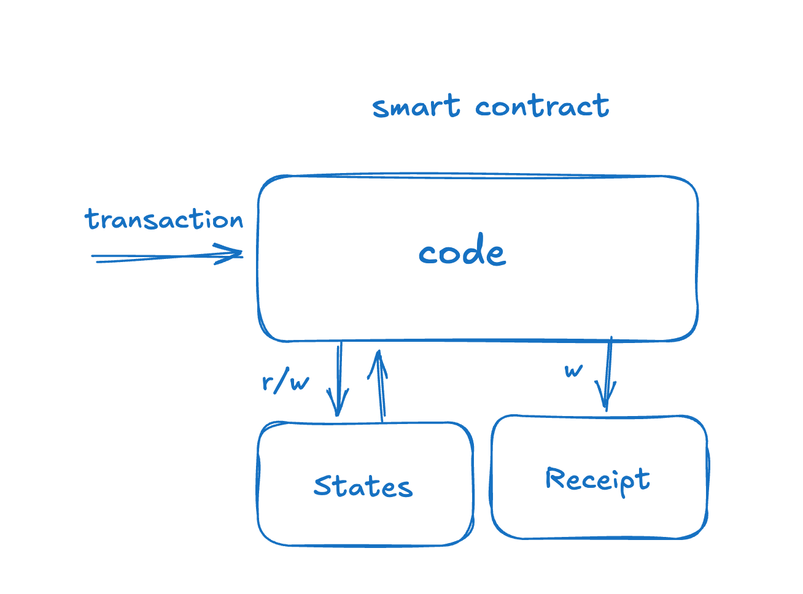

# Smart Action: 让 AI Agent 像智能合约一样以去中心化方式运行

## Smart Action: 基于LLM的合约!

如果我们要用一句话介绍 Smart Action，我们会说：一个 “基于LLM的合约”！

过去，区块链上的 dapp 只能通过智能合约实现，这要求编写简洁的代码 —— 因此其功能相对简单。

然而，Smart Action 通过在链上状态上执行，以无信任的方式运行，就像智能合约一样。不同之处在于，它不仅能编写代码，还能通过提示引入 AI 能力，从而实现真正“智能”的合约！

虽然智能合约部署在区块链上，但 Smart Action 部署在 AI Agent 内部！AI Agent 集成了 LLM、TEE 和智能合约，形成了一个强大的整体！

## 1. ElizaOS: 一个Web3友好的AI Agent框架

Eliza 是一个强大的多代理仿真框架，旨在创建、部署和管理自主 AI Agent。它使用 TypeScript 构建，提供了一个灵活且可扩展的平台，用于开发能够跨多个平台交互、同时保持一致个性和知识的智能代理。

ElizaOS 的关键特性是其插件和 Action 系统，这使开发者能够通过插件为 AI Agent 添加自定义功能。目前，ElizaOS 已包含许多与区块链和 DeFi 协议交互的插件。

## 2. focEliza: Fully on-chain ElizaOS Running on TEE and Blockchain

focEliza 是 ElizaOS 的一个兼容升级框架。它带来了以下改进：

- ElizaOS 框架和 LLM 运行在 TEE 内部，确保可验证计算。
- ElizaOS 的数据和状态管理托管在区块链上，确保状态的可验证性。

目前，ElizaOS 运行在集中式服务器上，与许多集中式机器人一样，在资金托管和公平性方面面临过度中心化的挑战。focEliza 完全去中心化了 ElizaOS，使其能够像区块链一样运行。这一转变使 AI Agent 成为一个独立、去中心化的实体，能够以无信任的方式处理任务。

## 3. Action: 为 AI Agent 添加自定义功能

Action 是 ElizaOS (AI Agent 框架) 内部的可扩展自定义功能组件，为 AI Agent 提供针对终端用户的特定功能。

作为 ElizaOS 的扩展，Action 使开发者能够添加自定义函数，使 AI Agent 能够处理特定场景的任务。

然而，当前的 ElizaOS 是集中式的，通常存在以下几个问题：

1. **Non-verifiability:** 无法验证 AI Agent 是否按照预定规则执行。
2. **Centralized State:** AI Agent 管理的状态存储在集中式数据库中，容易受到篡改。
3. **Fund Custody:** AI Agent 持有的私钥由集中式管理，管理员可访问，存在风险。

在 DeFAI、AI DAO 和链上游戏等场景中，这些中心化问题变得尤为关键。因此，focEliza 中的 Action 组件将进一步升级 —— 它将像智能合约一样运行！

## 4. Smart Contract: 状态转换函数

智能合约是一种去中心化的状态转换函数。当交易调用智能合约时，会触发其状态转换函数的执行：

1. 其输入为交易携带的 calldata 参数以及全局状态。
2. 执行后，状态转换函数会产生新的全局状态和一份回执。
3. 随后，智能合约保存新的全局状态。

## 5. Smart Prompt: 状态转换提示

Smart Action 的核心在于设计一个 **状态转换提示**。

该提示由 LLM 执行，并具备以下特殊能力：

1. 它接受 JSON 格式的状态数据。
2. 它限制 LLM 根据输入的状态数据进行处理。
3. 它强制生成新的状态。
4. 它要求 LLM 按照开发者描述的功能执行状态转换。

它具备与智能合约状态转换函数相同的属性：

- **Verifiability:** 它在 TEE 内执行，其执行过程和结果可被验证。
- **On-chain State:** 它的状态存储在区块链上，而非集中式数据库管理。

之前，开发者必须基于状态转换函数编写代码来构建去中心化应用。而现在，通过状态转换提示，开发者可以利用 prompt 工程构建去中心化应用，无需编写任何代码！

## 6. Smart Action: 让 AI Agent 为用户提供去中心化服务

配备了 Smart Action 的 AI Agent 将实现以下用例：

1. **实现零代码智能合约：**  
   过去，构建 dapp 需要编写安全可靠的智能合约代码。而现在，你可以通过定义自然语言提示达到同样目的！

2. **实现动态 AI Agent 扩展功能：**  
   通过 Smart Action，开发者可以随时为 AI Agent 部署去中心化功能。

3. **实现真正的 DeFAI：**  
   AI Agent 可以自主管理资金，动态部署 DeFAI 交互协议，并像智能合约一样以无信任方式运行 —— 这一切均可通过 Smart Action 实现！

## Resources

- [Smart Action插件](/zh/collection/plugins/smart-action)  
- [Smart Action快速开发指南](/zh/docs/smart-action/quick-start)
